# CHƯƠNG: PHÂN TÍCH VÀ THIẾT KẾ HỆ THỐNG

## Dự án: P2PShareFile - Ứng dụng chia sẻ file ngang hàng

---

## 1. SƠ ĐỒ CA SỬ DỤNG (USE CASE DIAGRAM)

### 1.1 Mô tả tổng quan

Hệ thống có 2 actor chính:

-  **Người dùng (User)**: Sử dụng ứng dụng client để chia sẻ và nhận file
-  **Relay Server**: Máy chủ trung gian hỗ trợ truyền file qua Internet

### 1.2 Sơ đồ Use Case (PlantUML)

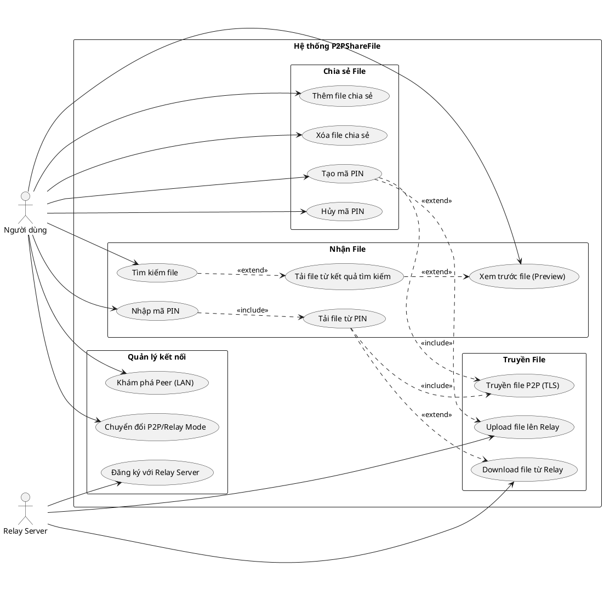

### 1.3 Danh sách Use Case

| STT | Mã UC | Tên Use Case        | Actor       | Mô tả ngắn                                              |
| --- | ----- | ------------------- | ----------- | ------------------------------------------------------- |
| 1   | UC1   | Thêm file chia sẻ   | User        | Chọn file/thư mục để chia sẻ với các peer khác          |
| 2   | UC2   | Xóa file chia sẻ    | User        | Hủy chia sẻ một file đã thêm                            |
| 3   | UC3   | Tạo mã PIN          | User        | Tạo mã 6 số để chia sẻ file nhanh (giống Send Anywhere) |
| 4   | UC4   | Hủy mã PIN          | User        | Hủy mã PIN trước khi hết hạn                            |
| 5   | UC5   | Nhập mã PIN         | User        | Nhập mã PIN 6 số để nhận file                           |
| 6   | UC6   | Tải file từ PIN     | User        | Download file sau khi nhập đúng PIN                     |
| 7   | UC7   | Tìm kiếm file       | User        | Tìm file theo tên trong mạng                            |
| 8   | UC8   | Tải file từ kết quả | User        | Download file từ kết quả tìm kiếm                       |
| 9   | UC9   | Xem trước file      | User        | Preview nội dung file trước khi tải                     |
| 10  | UC10  | Khám phá Peer       | User        | Tự động phát hiện peer trong mạng LAN                   |
| 11  | UC11  | Đăng ký với Relay   | Relay       | Đăng ký peer để discovery qua Internet                  |
| 12  | UC12  | Chuyển đổi Mode     | User        | Chọn chế độ P2P (LAN) hoặc Relay (Internet)             |
| 13  | UC13  | Truyền file P2P     | User        | Truyền file trực tiếp qua TLS socket                    |
| 14  | UC14  | Upload file Relay   | User, Relay | Upload file lên relay server (chunked)                  |
| 15  | UC15  | Download file Relay | User, Relay | Download file từ relay server (resume support)          |

---

## 2. SƠ ĐỒ KIẾN TRÚC HỆ THỐNG

### 2.1 Kiến trúc tổng quan

```
┌─────────────────────────────────────────────────────────────────────────────┐
│                           HỆ THỐNG P2PSHAREFILE                            │
├─────────────────────────────────────────────────────────────────────────────┤
│                                                                             │
│  ┌──────────────┐     ┌──────────────┐     ┌──────────────────────────────┐ │
│  │   CLIENT A   │     │   CLIENT B   │     │      RELAY SERVER           │ │
│  │  (JavaFX)    │     │  (JavaFX)    │     │   (HTTP Server - Java)      │ │
│  └──────┬───────┘     └──────┬───────┘     └──────────────┬───────────────┘ │
│         │                    │                            │                 │
│         │    MODE 1: P2P     │                            │                 │
│         │◄──────────────────►│                            │                 │
│         │   (TLS Socket)     │                            │                 │
│         │                    │                            │                 │
│         │           MODE 2: RELAY                         │                 │
│         │◄───────────────────────────────────────────────►│                 │
│         │                    │◄──────────────────────────►│                 │
│         │                    │        (HTTP/HTTPS)        │                 │
│                                                                             │
└─────────────────────────────────────────────────────────────────────────────┘
```

### 2.2 Kiến trúc phân lớp (Layered Architecture)

```
┌─────────────────────────────────────────────────────────────────┐
│                     PRESENTATION LAYER                          │
│  ┌─────────────────┐  ┌─────────────────┐  ┌─────────────────┐  │
│  │  MainController │  │   main-view.fxml│  │   styles.css    │  │
│  │    (JavaFX)     │  │    (FXML UI)    │  │   (Styling)     │  │
│  └─────────────────┘  └─────────────────┘  └─────────────────┘  │
├─────────────────────────────────────────────────────────────────┤
│                       SERVICE LAYER                             │
│  ┌─────────────────┐  ┌─────────────────┐  ┌─────────────────┐  │
│  │   P2PService    │  │ PINCodeService  │  │ PreviewService  │  │
│  │   (Facade)      │  │  (Quick Share)  │  │  (UltraView)    │  │
│  └─────────────────┘  └─────────────────┘  └─────────────────┘  │
├─────────────────────────────────────────────────────────────────┤
│                       NETWORK LAYER                             │
│  ┌─────────────────┐  ┌─────────────────┐  ┌─────────────────┐  │
│  │ PeerDiscovery   │  │FileTransferSvc  │  │ FileSearchSvc   │  │
│  │ (UDP Multicast) │  │  (TLS Socket)   │  │ (TLS Search)    │  │
│  └─────────────────┘  └─────────────────┘  └─────────────────┘  │
│  ┌─────────────────┐  ┌─────────────────┐                       │
│  │  RelayClient    │  │  RelayConfig    │                       │
│  │ (HTTP Client)   │  │ (Configuration) │                       │
│  └─────────────────┘  └─────────────────┘                       │
├─────────────────────────────────────────────────────────────────┤
│                       SECURITY LAYER                            │
│  ┌─────────────────┐  ┌─────────────────┐  ┌─────────────────┐  │
│  │SecurityManager  │  │  AESEncryption  │  │  FileHashUtil   │  │
│  │(TLS + ECDSA)    │  │  (AES-GCM-256)  │  │   (SHA-256)     │  │
│  └─────────────────┘  └─────────────────┘  └─────────────────┘  │
├─────────────────────────────────────────────────────────────────┤
│                        MODEL LAYER                              │
│  ┌───────────┐ ┌───────────┐ ┌─────────────┐ ┌───────────────┐  │
│  │ PeerInfo  │ │ FileInfo  │ │ShareSession │ │RelayFileInfo  │  │
│  └───────────┘ └───────────┘ └─────────────┘ └───────────────┘  │
│  ┌───────────────────┐ ┌───────────────────┐ ┌───────────────┐  │
│  │RelayTransferProgress│ │RelayUploadRequest│ │ SearchRequest │  │
│  └───────────────────┘ └───────────────────┘ └───────────────┘  │
└─────────────────────────────────────────────────────────────────┘
```

### 2.3 Thành phần chính

| Thành phần          | Package    | Mô tả                             |
| ------------------- | ---------- | --------------------------------- |
| MainController      | controller | Điều khiển giao diện JavaFX       |
| P2PService          | service    | Facade tổng hợp tất cả services   |
| PINCodeService      | service    | Quản lý mã PIN chia sẻ nhanh      |
| PreviewService      | service    | Xem trước file (UltraView)        |
| PeerDiscovery       | network    | Khám phá peer qua UDP multicast   |
| FileTransferService | network    | Truyền file qua TLS socket        |
| FileSearchService   | network    | Tìm kiếm file trong mạng          |
| RelayClient         | network    | Client giao tiếp với Relay Server |
| RelayServer         | relay      | HTTP Server trung gian            |
| SecurityManager     | security   | Quản lý TLS, ECDSA keypair        |
| AESEncryption       | security   | Mã hóa file AES-GCM-256           |
| FileHashUtil        | security   | Tính hash SHA-256/MD5             |

---

## 3. SƠ ĐỒ TRIỂN KHAI (DEPLOYMENT DIAGRAM)

### 3.1 Sơ đồ triển khai (PlantUML)

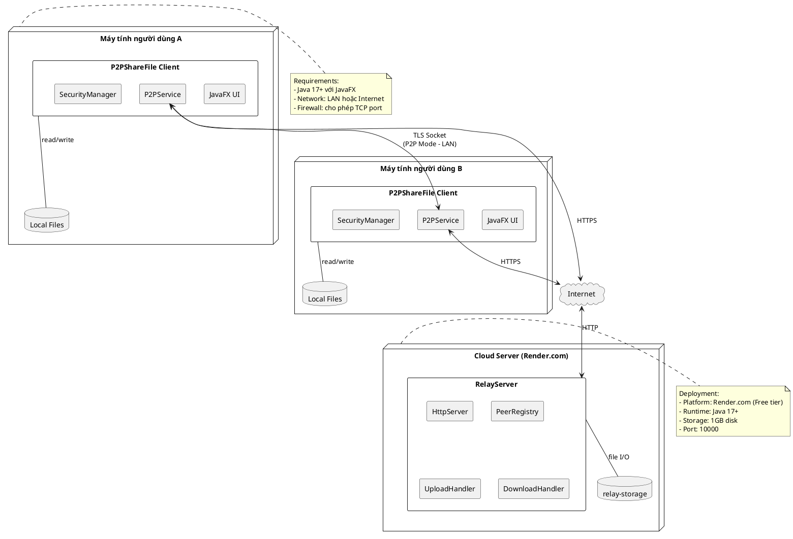

### 3.2 Cấu hình triển khai

| Thành phần    | Môi trường        | Cấu hình                                     |
| ------------- | ----------------- | -------------------------------------------- |
| Client        | Windows/Mac/Linux | Java 17+, JavaFX, Maven                      |
| Relay Server  | Render.com        | Java 17, 512MB RAM, 1GB disk                 |
| Network P2P   | LAN               | UDP 8888 (discovery), TCP dynamic (transfer) |
| Network Relay | Internet          | HTTPS port 10000                             |

---

## 4. SƠ ĐỒ LỚP (CLASS DIAGRAM)

### 4.1 Sơ đồ lớp chính (PlantUML)

```plantuml
@startuml Class_P2PShareFile
skinparam classAttributeIconSize 0

' === MODEL CLASSES ===
package "model" {
  class PeerInfo {
    - peerId: String
    - ipAddress: String
    - port: int
    - displayName: String
    - publicKey: String
    - lastSeen: long
    + updateLastSeen()
    + isOnline(): boolean
  }

  class FileInfo {
    - fileName: String
    - fileSize: long
    - filePath: String
    - checksum: String
    - ownerId: String
    - fileHash: String
    - relayFileInfo: RelayFileInfo
    + getFormattedSize(): String
  }

  class ShareSession {
    - pin: String
    - fileInfo: FileInfo
    - ownerPeer: PeerInfo
    - createdTime: long
    - expiryTime: long
    - active: boolean
    + isExpired(): boolean
    + getRemainingSeconds(): long
  }

  class RelayFileInfo {
    - uploadId: String
    - fileName: String
    - fileSize: long
    - fileHash: String
    - downloadUrl: String
    - senderId: String
    - encrypted: boolean
    - expiryTime: long
    + isExpired(): boolean
  }

  class RelayTransferProgress {
    - transferId: String
    - type: TransferType
    - status: TransferStatus
    - totalBytes: long
    - transferredBytes: long
    - currentChunk: int
    - totalChunks: int
    + updateProgress(bytes)
    + getPercentage(): double
  }

  enum TransferType {
    UPLOAD
    DOWNLOAD
  }

  enum TransferStatus {
    PENDING
    IN_PROGRESS
    PAUSED
    COMPLETED
    FAILED
    CANCELLED
  }
}

' === SERVICE CLASSES ===
package "service" {
  class P2PService {
    - localPeer: PeerInfo
    - securityManager: SecurityManager
    - peerDiscovery: PeerDiscovery
    - fileSearchService: FileSearchService
    - fileTransferService: FileTransferService
    - pinCodeService: PINCodeService
    + start()
    + stop()
    + shareFile(file): FileInfo
    + searchFiles(query)
    + downloadFile(peer, fileInfo)
    + createPIN(fileInfo): String
    + redeemPIN(pin): ShareSession
  }

  class PINCodeService {
    - localSessions: Map<String, ShareSession>
    - globalSessions: Map<String, ShareSession>
    - relayClient: RelayClient
    + start()
    + stop()
    + createPIN(fileInfo): String
    + findPIN(pin): ShareSession
    + broadcastPIN(session)
  }

  class PreviewService {
    - previewCacheService: PreviewCacheService
    + generatePreview(file): PreviewContent
    + getPreviewManifest(fileHash): PreviewManifest
  }
}

' === NETWORK CLASSES ===
package "network" {
  class PeerDiscovery {
    - localPeer: PeerInfo
    - discoveredPeers: Map<String, PeerInfo>
    - multicastSocket: MulticastSocket
    + start()
    + stop()
    + getDiscoveredPeers(): List<PeerInfo>
  }

  class FileTransferService {
    - localPeer: PeerInfo
    - securityManager: SecurityManager
    - relayClient: RelayClient
    + start()
    + stop()
    + downloadFile(peer, fileInfo, saveDir)
    + downloadFileWithFallback(peer, fileInfo, saveDir)
    + uploadFileViaRelay(file, recipient)
  }

  class RelayClient {
    - config: RelayConfig
    - encryptionKey: SecretKey
    + uploadFile(file, request): RelayFileInfo
    + downloadFile(fileInfo, destFile): boolean
    + registerPeer(peer): boolean
    + discoverPeers(excludeId): List<PeerInfo>
    + createPIN(pin, fileInfo): boolean
    + findPIN(pin): RelayFileInfo
  }

  class RelayConfig {
    - serverUrl: String
    - chunkSize: int
    - maxRetries: int
    - enableEncryption: boolean
    - preferP2P: boolean
    + forDevelopment(): RelayConfig
    + forProduction(url, apiKey): RelayConfig
  }
}

' === SECURITY CLASSES ===
package "security" {
  class SecurityManager {
    - keyPair: KeyPair
    - sslContext: SSLContext
    + createSSLSocket(host, port): SSLSocket
    + createSSLServerSocket(port): SSLServerSocket
    + signMessage(data): byte[]
    + verifySignature(data, signature, publicKey): boolean
    + getPublicKeyEncoded(): String
  }

  class AESEncryption {
    + {static} encrypt(data, key): byte[]
    + {static} decrypt(data, key): byte[]
    + {static} createKeyFromString(keyStr): SecretKey
  }

  class FileHashUtil {
    + {static} calculateSHA256(file): String
    + {static} calculateMD5(file): String
    + {static} verifyHash(file, expectedHash): boolean
  }
}

' === RELAY SERVER ===
package "relay" {
  class RelayServer {
    - port: int
    - storageDir: Path
    - uploads: Map<String, UploadSession>
    - peerRegistry: PeerRegistry
    + start()
    + stop()
  }

  class PeerRegistry {
    - peers: Map<String, RegisteredPeer>
    + registerPeer(peerId, displayName, ip, port, publicKey)
    + heartbeat(peerId)
    + getPeersExcluding(excludeId): List<PeerInfo>
    + cleanupExpiredPeers()
  }
}

' === RELATIONSHIPS ===
P2PService "1" *-- "1" PeerDiscovery
P2PService "1" *-- "1" FileTransferService
P2PService "1" *-- "1" FileSearchService
P2PService "1" *-- "1" PINCodeService
P2PService "1" *-- "1" SecurityManager

PINCodeService --> RelayClient : uses
FileTransferService --> RelayClient : uses

ShareSession "1" --> "1" FileInfo
ShareSession "1" --> "1" PeerInfo
FileInfo "0..1" --> "0..1" RelayFileInfo

RelayClient --> RelayConfig : uses
RelayServer "1" *-- "1" PeerRegistry

RelayTransferProgress +-- TransferType
RelayTransferProgress +-- TransferStatus

@enduml
```

### 4.2 Bảng mô tả các lớp chính

| Lớp                   | Loại     | Mô tả                                              |
| --------------------- | -------- | -------------------------------------------------- |
| PeerInfo              | Entity   | Thông tin một peer (ID, IP, port, tên, public key) |
| FileInfo              | Entity   | Thông tin file chia sẻ (tên, size, path, hash)     |
| ShareSession          | Entity   | Phiên chia sẻ với mã PIN                           |
| RelayFileInfo         | Entity   | Thông tin file trên relay server                   |
| RelayTransferProgress | Entity   | Tiến độ upload/download                            |
| P2PService            | Facade   | Service chính tổng hợp các module                  |
| PINCodeService        | Service  | Quản lý mã PIN chia sẻ nhanh                       |
| PeerDiscovery         | Network  | Khám phá peer qua UDP multicast                    |
| FileTransferService   | Network  | Truyền file P2P hoặc qua Relay                     |
| RelayClient           | Network  | Client giao tiếp với Relay Server                  |
| SecurityManager       | Security | Quản lý TLS, ECDSA, SSL context                    |
| AESEncryption         | Utility  | Mã hóa/giải mã AES-GCM-256                         |
| FileHashUtil          | Utility  | Tính hash SHA-256/MD5                              |
| RelayServer           | Server   | HTTP Server trung gian                             |
| PeerRegistry          | Server   | Quản lý danh sách peer đăng ký                     |

---

## 5. SƠ ĐỒ TUẦN TỰ (SEQUENCE DIAGRAM)

### 5.1 Chia sẻ file bằng mã PIN (Mode P2P)

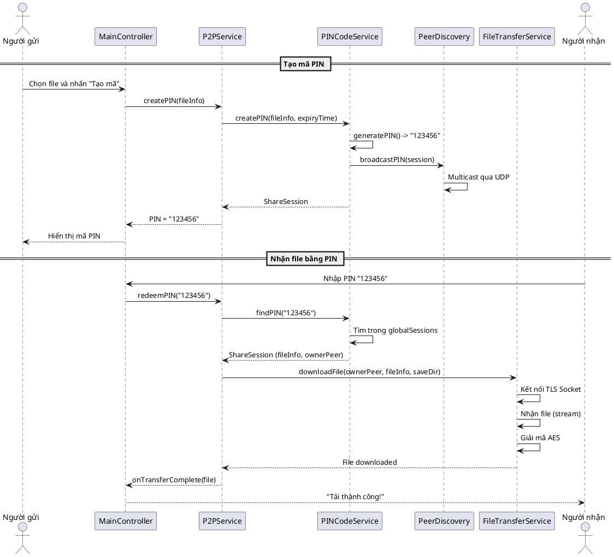

### 5.2 Chia sẻ file bằng mã PIN (Mode Relay)

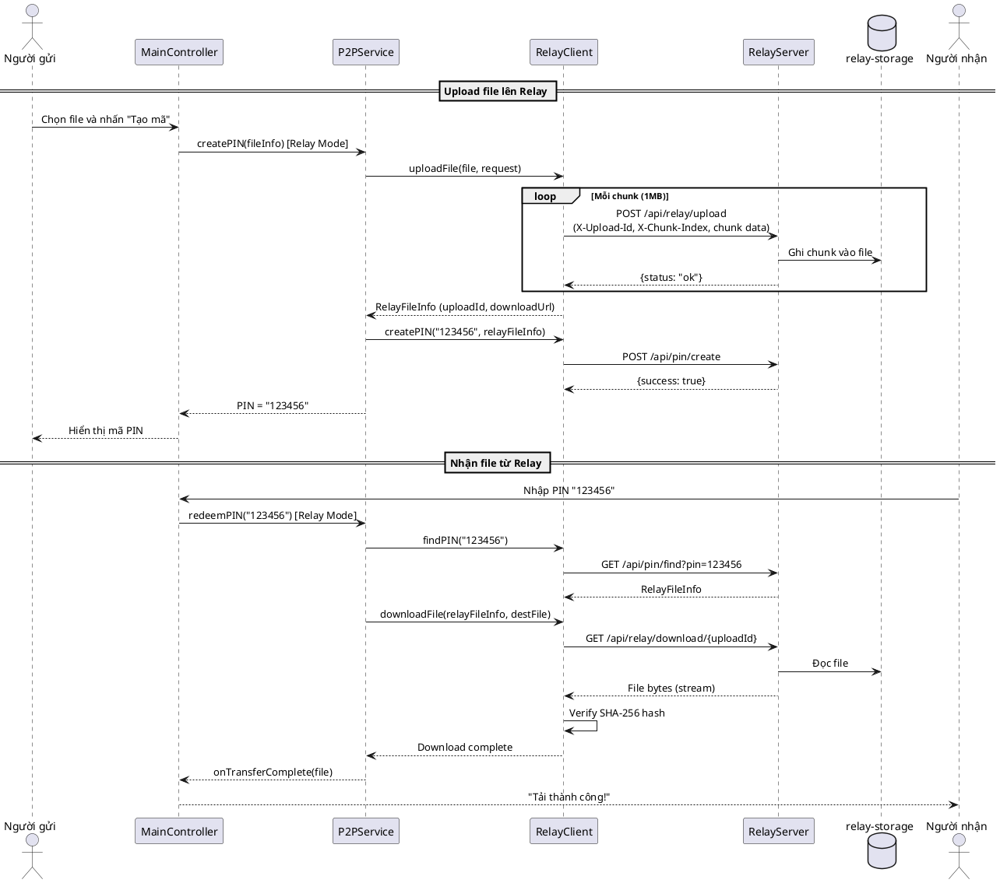

### 5.3 Tìm kiếm và tải file

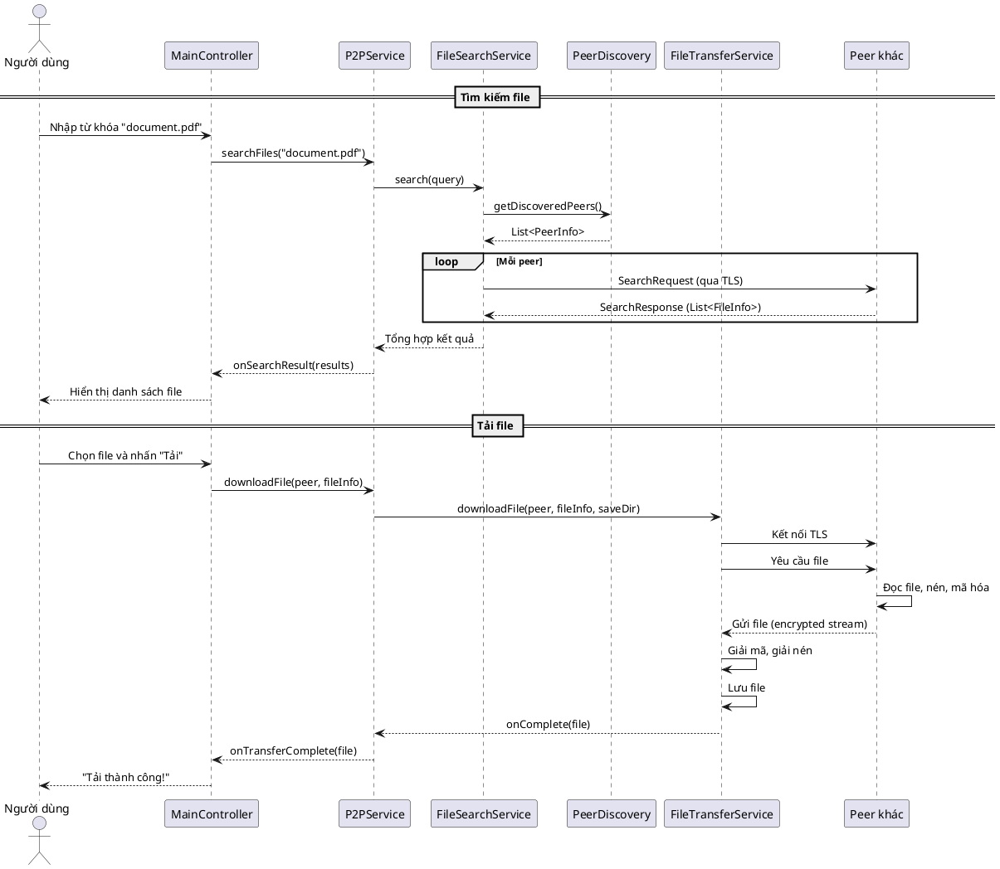

---

## 6. SƠ ĐỒ HOẠT ĐỘNG (ACTIVITY DIAGRAM)

### 6.1 Quy trình chia sẻ file bằng PIN

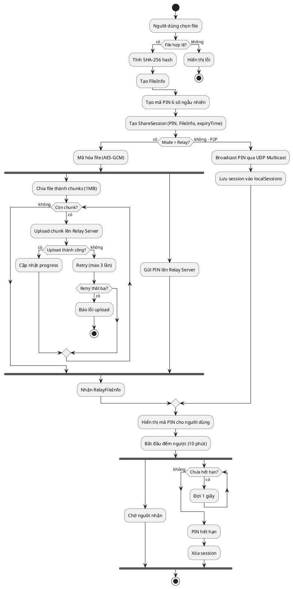

### 6.2 Quy trình nhận file bằng PIN

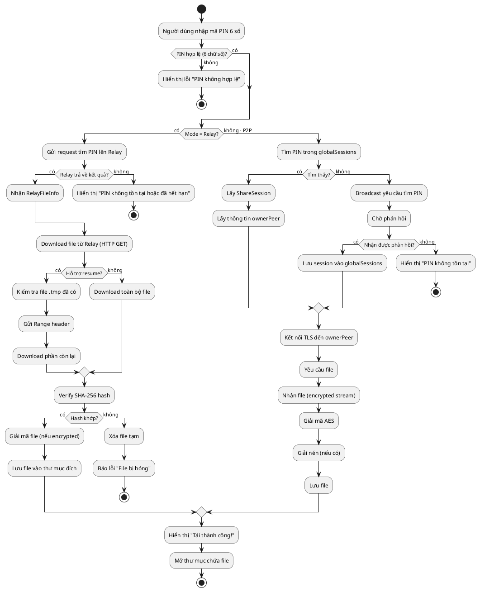

---

## 7. SƠ ĐỒ TRẠNG THÁI (STATE DIAGRAM)

### 7.1 Trạng thái của Transfer Session

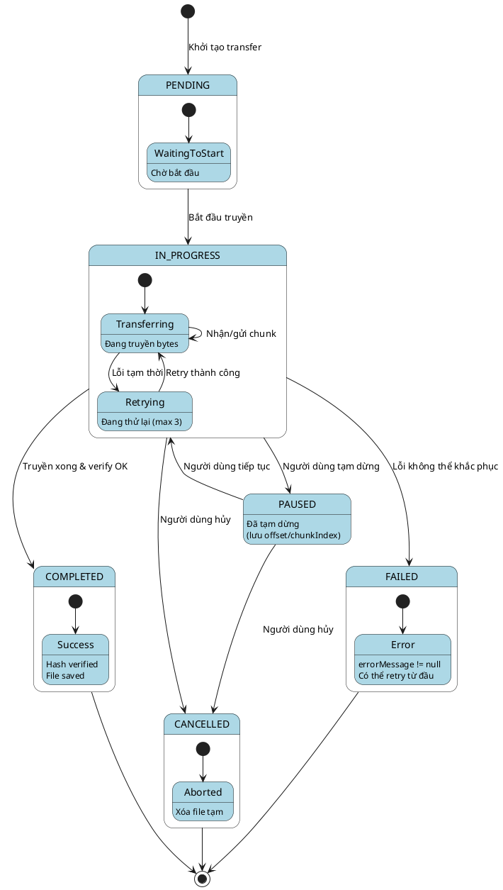

### 7.2 Trạng thái của ShareSession (PIN)

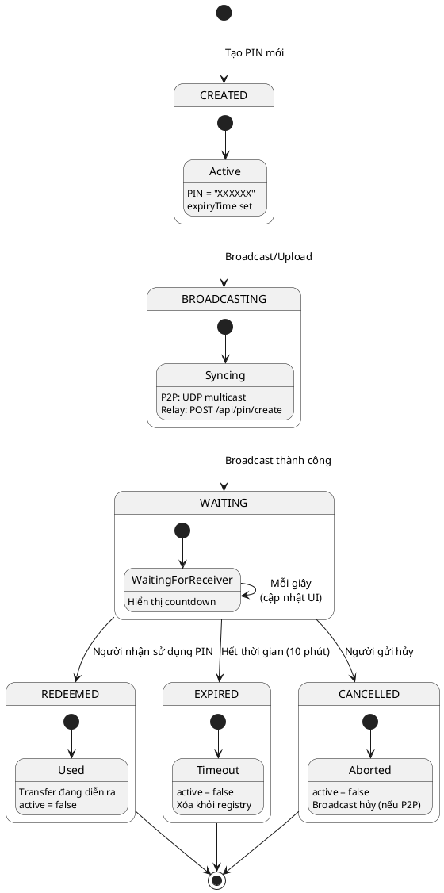

### 7.3 Trạng thái của PeerInfo

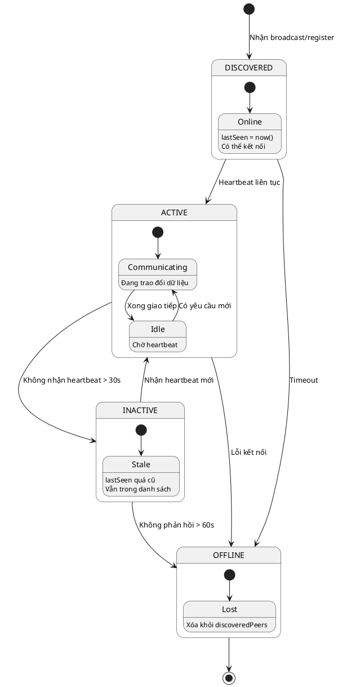

---

## 8. BẢNG ĐẶC TẢ USE CASE

### 8.1 UC3: Tạo mã PIN

| Mục                | Nội dung                                                                                                                                                                                                                                                                                                                                                 |
| ------------------ | -------------------------------------------------------------------------------------------------------------------------------------------------------------------------------------------------------------------------------------------------------------------------------------------------------------------------------------------------------- |
| **Mã UC**          | UC3                                                                                                                                                                                                                                                                                                                                                      |
| **Tên**            | Tạo mã PIN                                                                                                                                                                                                                                                                                                                                               |
| **Actor**          | Người dùng                                                                                                                                                                                                                                                                                                                                               |
| **Mô tả**          | Người dùng chọn file và tạo mã PIN 6 số để chia sẻ nhanh                                                                                                                                                                                                                                                                                                 |
| **Tiền điều kiện** | - Ứng dụng đã khởi động<br>- Có ít nhất 1 file được chọn                                                                                                                                                                                                                                                                                                 |
| **Hậu điều kiện**  | - Mã PIN được tạo và hiển thị<br>- Session được lưu và broadcast                                                                                                                                                                                                                                                                                         |
| **Luồng chính**    | 1. Người dùng chọn file cần chia sẻ<br>2. Người dùng nhấn nút "Tạo mã"<br>3. Hệ thống tính hash SHA-256 của file<br>4. Hệ thống tạo mã PIN 6 số ngẫu nhiên<br>5. Hệ thống tạo ShareSession với thời hạn 10 phút<br>6. [Mode P2P] Broadcast PIN qua UDP multicast<br>7. [Mode Relay] Upload file và gửi PIN lên server<br>8. Hiển thị mã PIN và đếm ngược |
| **Luồng ngoại lệ** | 3a. File không tồn tại → Hiển thị lỗi<br>7a. Upload thất bại → Retry 3 lần, nếu vẫn lỗi → Báo lỗi                                                                                                                                                                                                                                                        |
| **Ghi chú**        | PIN tự động hết hạn sau 10 phút                                                                                                                                                                                                                                                                                                                          |

### 8.2 UC6: Tải file từ PIN

| Mục                | Nội dung                                                                                                                                                                                                                                                                                                                                                                      |
| ------------------ | ----------------------------------------------------------------------------------------------------------------------------------------------------------------------------------------------------------------------------------------------------------------------------------------------------------------------------------------------------------------------------- |
| **Mã UC**          | UC6                                                                                                                                                                                                                                                                                                                                                                           |
| **Tên**            | Tải file từ PIN                                                                                                                                                                                                                                                                                                                                                               |
| **Actor**          | Người dùng                                                                                                                                                                                                                                                                                                                                                                    |
| **Mô tả**          | Người dùng nhập mã PIN để tải file được chia sẻ                                                                                                                                                                                                                                                                                                                               |
| **Tiền điều kiện** | - Ứng dụng đã khởi động<br>- Có mã PIN hợp lệ từ người gửi                                                                                                                                                                                                                                                                                                                    |
| **Hậu điều kiện**  | - File được tải về thư mục đích<br>- Hash được verify                                                                                                                                                                                                                                                                                                                         |
| **Luồng chính**    | 1. Người dùng nhập mã PIN 6 số<br>2. Người dùng nhấn "Nhận file"<br>3. Hệ thống tìm kiếm PIN<br>4. [Mode P2P] Tìm trong globalSessions hoặc broadcast<br>5. [Mode Relay] Gửi request lên server<br>6. Nhận thông tin file (FileInfo/RelayFileInfo)<br>7. Bắt đầu download file<br>8. Verify hash SHA-256<br>9. Lưu file vào thư mục đích<br>10. Hiển thị thông báo thành công |
| **Luồng ngoại lệ** | 3a. PIN không tồn tại → Hiển thị "PIN không hợp lệ"<br>3b. PIN đã hết hạn → Hiển thị "PIN đã hết hạn"<br>7a. Download thất bại → Retry hoặc báo lỗi<br>8a. Hash không khớp → Xóa file, báo lỗi                                                                                                                                                                                |
| **Ghi chú**        | Hỗ trợ resume nếu download bị gián đoạn                                                                                                                                                                                                                                                                                                                                       |

### 8.3 UC7: Tìm kiếm file

| Mục                | Nội dung                                                                                                                                                                                                                                                                                      |
| ------------------ | --------------------------------------------------------------------------------------------------------------------------------------------------------------------------------------------------------------------------------------------------------------------------------------------- |
| **Mã UC**          | UC7                                                                                                                                                                                                                                                                                           |
| **Tên**            | Tìm kiếm file                                                                                                                                                                                                                                                                                 |
| **Actor**          | Người dùng                                                                                                                                                                                                                                                                                    |
| **Mô tả**          | Tìm file theo tên trong mạng (LAN hoặc qua Relay)                                                                                                                                                                                                                                             |
| **Tiền điều kiện** | - Ứng dụng đã khởi động<br>- Có ít nhất 1 peer khác trong mạng                                                                                                                                                                                                                                |
| **Hậu điều kiện**  | - Danh sách kết quả tìm kiếm được hiển thị                                                                                                                                                                                                                                                    |
| **Luồng chính**    | 1. Người dùng nhập từ khóa tìm kiếm<br>2. Người dùng nhấn "Tìm"<br>3. [Mode P2P] Gửi SearchRequest đến tất cả peer qua TLS<br>4. [Mode Relay] Gửi request lên /api/files/search<br>5. Thu thập kết quả từ các peer/server<br>6. Lọc và sắp xếp kết quả<br>7. Hiển thị danh sách file tìm được |
| **Luồng ngoại lệ** | 3a. Không có peer nào → Hiển thị "Không tìm thấy peer"<br>5a. Không có kết quả → Hiển thị "Không tìm thấy file"                                                                                                                                                                               |
| **Ghi chú**        | Tìm kiếm không phân biệt hoa thường                                                                                                                                                                                                                                                           |

### 8.4 UC14: Upload file lên Relay

| Mục                | Nội dung                                                                                                                                                                                                                                                                                                             |
| ------------------ | -------------------------------------------------------------------------------------------------------------------------------------------------------------------------------------------------------------------------------------------------------------------------------------------------------------------- |
| **Mã UC**          | UC14                                                                                                                                                                                                                                                                                                                 |
| **Tên**            | Upload file lên Relay                                                                                                                                                                                                                                                                                                |
| **Actor**          | Người dùng, Relay Server                                                                                                                                                                                                                                                                                             |
| **Mô tả**          | Upload file lên relay server theo chunks để chia sẻ qua Internet                                                                                                                                                                                                                                                     |
| **Tiền điều kiện** | - Đang ở Relay Mode<br>- Relay server đang chạy<br>- File đã được chọn                                                                                                                                                                                                                                               |
| **Hậu điều kiện**  | - File được lưu trên relay server<br>- RelayFileInfo được trả về với downloadUrl                                                                                                                                                                                                                                     |
| **Luồng chính**    | 1. Tính hash SHA-256 của file<br>2. Mã hóa file bằng AES-GCM (nếu bật)<br>3. Chia file thành chunks (1MB mỗi chunk)<br>4. Tạo uploadId (UUID)<br>5. Với mỗi chunk:<br> 5a. Gửi POST /api/relay/upload với headers<br> 5b. Nhận response {status: "ok"}<br> 5c. Cập nhật progress<br>6. Nhận RelayFileInfo hoàn chỉnh |
| **Luồng ngoại lệ** | 5a. Upload chunk thất bại → Retry (max 3 lần)<br>5a. Retry thất bại → Báo lỗi, dừng upload                                                                                                                                                                                                                           |
| **Ghi chú**        | Chunk size có thể cấu hình trong RelayConfig                                                                                                                                                                                                                                                                         |

---

## 9. BẢNG THUẬT NGỮ

| Thuật ngữ     | Giải thích                                                       |
| ------------- | ---------------------------------------------------------------- |
| P2P           | Peer-to-Peer, mô hình mạng ngang hàng                            |
| Peer          | Một node trong mạng P2P                                          |
| Relay         | Server trung gian chuyển tiếp dữ liệu                            |
| PIN           | Personal Identification Number - Mã số cá nhân 6 chữ số          |
| Chunk         | Mảnh/phần nhỏ của file khi chia để upload                        |
| TLS           | Transport Layer Security - Giao thức bảo mật tầng vận chuyển     |
| AES-GCM       | Advanced Encryption Standard - Galois/Counter Mode               |
| SHA-256       | Secure Hash Algorithm 256-bit                                    |
| ECDSA         | Elliptic Curve Digital Signature Algorithm                       |
| UDP Multicast | Gửi tin nhắn đến nhiều host cùng lúc qua UDP                     |
| Resume        | Tiếp tục tải từ vị trí đã dừng                                   |
| Hash          | Giá trị băm dùng để kiểm tra tính toàn vẹn                       |
| Facade        | Design pattern cung cấp interface đơn giản cho hệ thống phức tạp |

---

## 10. HƯỚNG DẪN VẼ SƠ ĐỒ

### Công cụ đề xuất:

1. **PlantUML**: Copy code trong các block `plantuml` vào https://www.plantuml.com/plantuml/uml/
2. **Draw.io**: https://app.diagrams.net/ - Vẽ thủ công dựa trên mô tả
3. **Lucidchart**: https://www.lucidchart.com/
4. **StarUML**: Phần mềm desktop

### Xuất ảnh:

-  Với PlantUML: Paste code → Generate → Download PNG/SVG
-  Với Draw.io: File → Export as → PNG/PDF

---

_Tài liệu được tạo tự động dựa trên phân tích mã nguồn dự án P2PShareFile_
_Ngày tạo: 21/12/2025_
